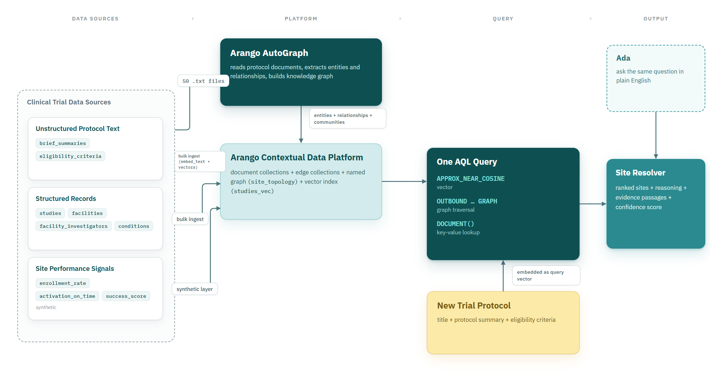
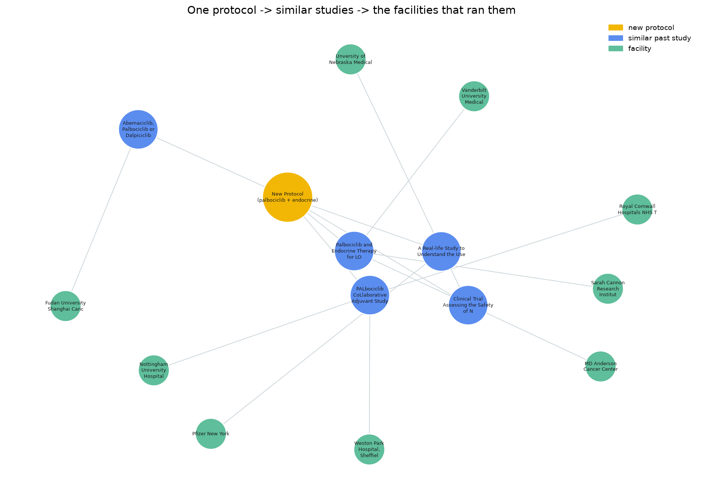
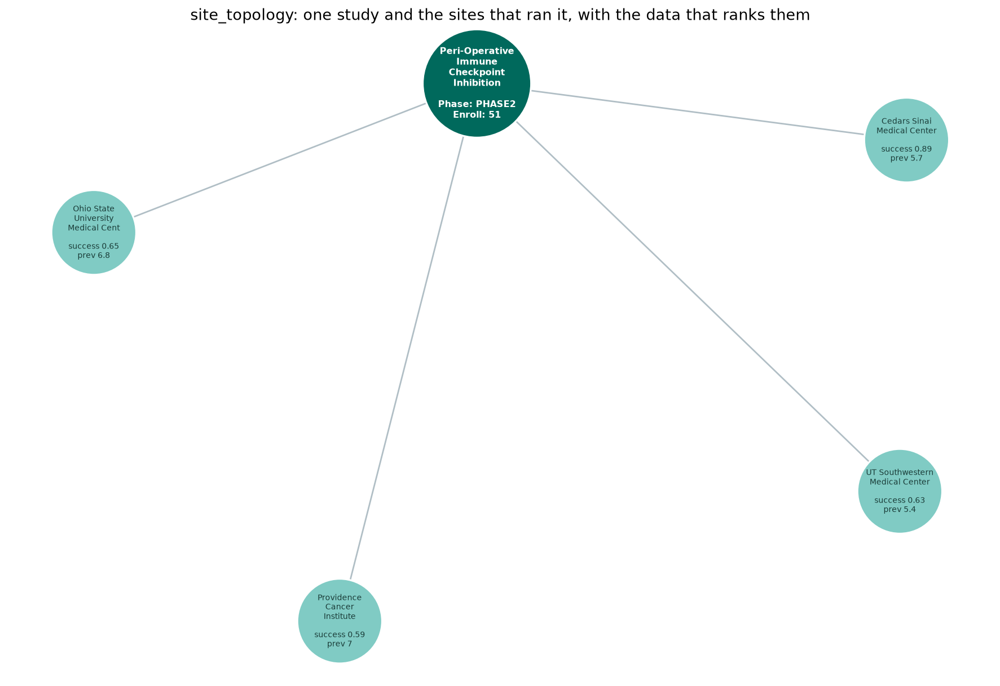
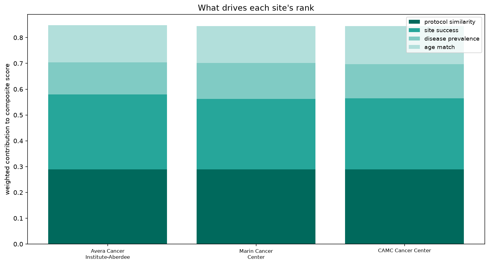
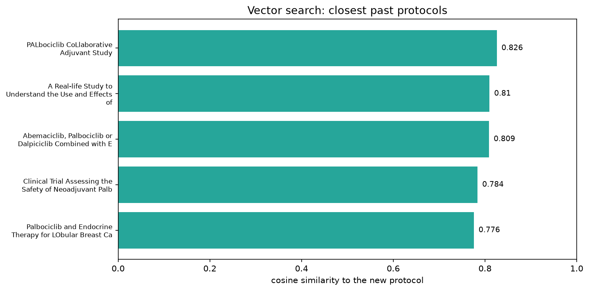
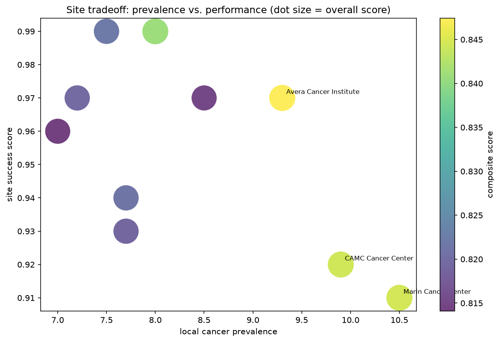

# Clinical Trial Site Recommender

**An explainable, multi-variable trial-site recommender that composes vector search, graph traversal, key-value lookup, and a context graph into a single workflow on the Arango Contextual Data Platform.**


A new trial protocol comes in. The system finds the past studies closest to it in meaning, walks the graph to the facilities that ran them, scores each facility across five site-selection variables, and returns a ranked recommendation with a per-variable breakdown, the supporting evidence, and a confidence signal. Four data models, one query path, no separate vector store, graph database, or retrieval service to hold together in application code.



## Why this exists

Selecting sites for an oncology trial means pulling evidence from trial registries, investigator databases, enrollment records, and protocol documents, then reconciling it by hand. Roughly 40 to 50 percent of chosen sites underperform or never enroll a patient, and each activation runs about $30,000. The cost is not a missing algorithm; it is that the signals live in four different shapes across four systems. This project holds all four in one store and ranks sites across them at once, rather than sorting on a single field.

## What drives a recommendation

| Variable | Signal | Source | Data model |
|----------|--------|--------|------------|
| Protocol | semantic distance to past studies | embedded protocol text | vector index |
| Performance | historical site success | facility fields | key-value |
| Prevalence | local cancer prevalence | CDC PLACES (real) | key-value |
| Demographics | local median-age fit | generated stand-in | key-value |
| Dosage | drug and schedule | AutoGraph context graph | context graph |

## The recommendation in one picture

The incoming protocol, the five studies closest to it in meaning, and the facilities that ran them.



## The query at the center

The four database-side variables resolve in a single AQL statement. The vector search sits in its own top-level `SORT` and `LIMIT`, which `APPROX_NEAR_COSINE` requires; the traversal and scoring follow. The weights and neutral stand-ins are passed as bind parameters (`@w_protocol`, `@neutral_prev`, and so on); their working values are listed in the comment below.

```aql
// Weights: protocol 0.35 · site success 0.30 · prevalence 0.20 · age 0.15
// Neutral stand-ins for sites without geo data: prevalence 0.3 · age 0.5
LET similar = (
    FOR s IN studies
        LET sim = APPROX_NEAR_COSINE(s.embedding, @vec)
        SORT sim DESC
        LIMIT 5
        RETURN { nct_id: s.nct_id, title: s.brief_title, similarity: sim }
)

LET sites = (
    FOR study IN similar
        FOR v IN 1..1 OUTBOUND CONCAT("studies/", study.nct_id) GRAPH "site_topology"
            FILTER IS_SAME_COLLECTION("facilities", v)
            FILTER v.success_score != null
            LET has_geo = v.cancer_prevalence != null
            LET prevalence_score = has_geo ? (v.cancer_prevalence / 15) : @neutral_prev
            LET age_score = (has_geo AND v.median_age != null)
                            ? ((50 - ABS(v.median_age - 40)) / 50) : @neutral_age
            LET composite = (study.similarity * @w_protocol)
                          + (v.success_score  * @w_perf)
                          + (prevalence_score * @w_prev)
                          + (age_score        * @w_age)
            COLLECT
                name = v.name, city = v.city, country = v.country,
                success_score = v.success_score, prevalence = v.cancer_prevalence,
                median_age = v.median_age, has_geo_data = has_geo
            AGGREGATE score = MAX(composite),
                      via_similarity = MAX(study.similarity),
                      prev_sub = MAX(prevalence_score),
                      age_sub  = MAX(age_score)
            SORT score DESC
            LIMIT 10
            RETURN {
                name, city, country, success_score, prevalence, median_age, has_geo_data,
                composite_score: score, matched_similarity: via_similarity,
                prevalence_score: prev_sub, age_score: age_sub
            }
)

RETURN { similar_studies: similar, recommended_sites: sites }
```

The traversal runs a single hop: the `site_topology` edges connect each study to the facilities that ran it, so the facilities are exactly one step out. The `@vec` bind parameter is the embedding of the incoming protocol, produced by `resolver.py` before the query runs. `CONCAT("studies/", study.nct_id)` builds each document handle directly, which works because a study's key is its NCT ID.

The fifth variable, dosage, comes from a separate AutoGraph Retriever call and is folded into the reasoning. Sites missing population data are scored on neutral stand-ins rather than dropped, so a strong site outside the external-data coverage still surfaces, flagged for lower confidence.

## Example output

For a Phase III palbociclib plus endocrine therapy protocol (HR-positive, HER2-negative):

```
=== RECOMMENDED SITES (protocol + performance + prevalence + age) ===
1. Avera Cancer Institute-Aberdeen -- Aberdeen, US    overall: 0.847
   Protocol similarity  0.826  (35%)
   Site success         0.97   (30%)
   Disease prevalence   0.62   (20%)
   Age match            0.956  (15%)
2. Marin Cancer Center             -- Greenbrae, US   overall: 0.845
3. CAMC Cancer Center              -- Charleston, US  overall: 0.844

=== REASONING ===
Avera outranks Marin primarily on site success, which more than offsets Marin's
stronger local prevalence. Regarding dosage, the matched trials use standard dosing
for this drug class.

=== CONFIDENCE ===
high -- strong match, sufficient sites, complete data across all variables
```

The closest past study to a palbociclib-only protocol is a trial testing three CDK4/6 inhibitors. The two share almost no exact wording, so keyword search passes it over; the vector search finds it through shared clinical meaning. What makes this work is that Arango runs the semantic match and the graph traversal in the same query, so the recommendation reflects both what a protocol means and how sites connect to relevant trials.

## Repository layout

```
src/
  ingest.py        # AACT -> graph + embeddings + vector index + synthetic performance
  enrich.py        # joins CDC prevalence + demographics onto sites by geography
  export_docs.py   # writes 50 protocol docs for AutoGraph
  resolver.py      # the five-variable recommender: the marquee query, reasoning, confidence
data/
  protocol_sample.json
assets/            # generated figures
site_recommender.ipynb   # end-to-end demonstration notebook
requirements.txt
.env.example
```

## Build and run

```bash
git clone <this-repo>
cd site-recommender
pip install -r requirements.txt
cp .env.example .env        # add Arango and OpenAI credentials, and the Retriever service ID
```

The build scripts run once to populate the database, after which a recommendation is a single command:

```bash
python src/ingest.py         # load AACT, embed protocols, build the graph and vector index
python src/enrich.py         # attach CDC prevalence and demographics by geography
python src/export_docs.py    # write protocol docs for upload to AutoGraph
python src/resolver.py data/protocol_sample.json
```

`site_recommender.ipynb` runs the whole recommendation against an already-built database and generates the figures below.

## Prerequisites

- Access to the Arango Contextual Data Platform with the Agentic AI Suite enabled (AutoGraph and Ada are enterprise-tier, requested through the [demo page](https://arango.ai/))
- Python 3.11+ and an OpenAI API key
- The [AACT dataset](https://aact.ctti-clinicaltrials.org/) extracted into `data/aact_sample/`

## What the pipeline produces

| | |
|---|---|
|  | **Topology.** One study and the sites that ran it, each carrying the data that ranks it. |
|  | **Score breakdown.** Every top site's per-variable contribution to its composite score. |
|  | **Vector search.** The closest past protocols by cosine similarity. |
|  | **Tradeoff.** Prevalence against performance across all candidates, sized by overall score. |

## Design boundaries and how to move past them

Every boundary below is a deliberate decision made against a real-world data constraint, with a clear path to production.

**Synthetic performance and demographics.** Site-level trial outcomes are not public, and the live Census demographic API sits behind a key, so the performance signal and the age signal are generated. This is intentional and isolated: both are single, swappable layers, and the schema, the query, and the scoring stay identical when real data replaces them. In production these come straight from a CRM or trial-management system and a licensed census feed. Prevalence is already real, pulled live from CDC PLACES, which proves the external-data path end to end.

**US-only population coverage.** CDC PLACES covers the United States, so international sites arrive without prevalence or age. Rather than dropping them, the resolver scores them on neutral stand-ins and lowers the confidence signal, so a strong overseas site still surfaces and is flagged honestly. Extending coverage is a matter of adding a second geographic source; the geography join already generalizes.

**Investigator entity resolution.** AACT records investigator identity as free-text names with no stable IDs, so the same person appears as several nodes. The recommendation rides on study-to-site links, which are clean, so the investigator side is present but not yet trusted. A resolution pass (blocking plus similarity matching on name and affiliation) collapses the duplicates and unlocks investigator-level reasoning.

**Context graph corpus size.** The AutoGraph context graph is built from a 50-protocol sample, enough to prove rich dosage and treatment-approach extraction while staying fast and inexpensive. Scaling to the full corpus is a settings change on the AutoGraph import, and dosage relevance sharpens as more dose-bearing protocols enter the graph.

None of these boundaries touch the core claim: five variables, four data models, one workflow, with real semantic search, real graph traversal, and real prevalence data already in place.

## Extending it

Replace the synthetic layers with real CRM and census data; the schema does not change, only the source. Expand the AutoGraph corpus for richer entity extraction. Wrap `resolver.py` as a tool inside an agent framework to turn a single recommendation into a multi-step feasibility workflow: protocol intake, site shortlisting, investigator verification, activation scheduling.

## Acknowledgements

Built on the [Arango Contextual Data Platform](https://arango.ai/). Trial data from [AACT](https://aact.ctti-clinicaltrials.org/) (ClinicalTrials.gov). Cancer prevalence from [CDC PLACES](https://www.cdc.gov/places/).